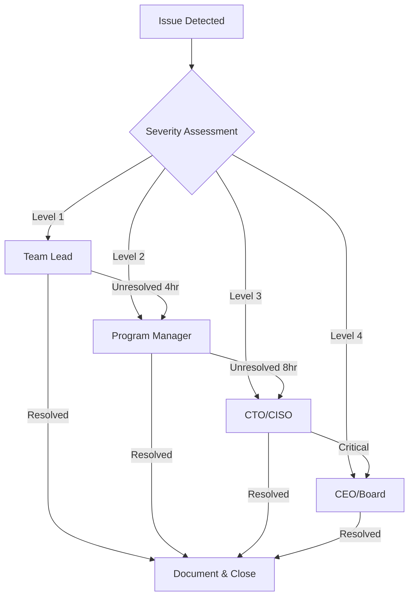

# STRATEGIC DECISION FRAMEWORK
## Phase 1 Technical Validation - ORCHESTRIX Integration

**Authority:** ORCHESTRIX_PRIME  
**Version:** 1.0  
**Effective Date:** 2025-08-08  
**Review Cycle:** Daily during Phase 1

---

## 1. DECISION AUTHORITY MATRIX

### 1.1 Autonomous Decisions (ORCHESTRIX_PRIME Authority)
| Decision Type | Threshold | Approval Required | SLA |
|--------------|-----------|-------------------|-----|
| Resource reallocation | < 20% change | None | Immediate |
| Test scheduling | All | None | 1 hour |
| Priority adjustments | Non-critical | None | 2 hours |
| Tool selection | < $10K | None | 4 hours |
| Team coordination | All routine | None | Immediate |

### 1.2 Consultative Decisions (Human Input Required)
| Decision Type | Threshold | Approver | SLA |
|--------------|-----------|----------|-----|
| Milestone delays | > 24 hours | Program Manager | 4 hours |
| Budget overruns | > 10% | Finance Director | 8 hours |
| Scope changes | Any | Product Owner | 12 hours |
| Architecture changes | Major | CTO | 24 hours |
| Security exemptions | Any | CISO | 4 hours |

### 1.3 Board-Level Decisions
| Decision Type | Trigger | Escalation Path | SLA |
|--------------|---------|-----------------|-----|
| Program termination | Critical failure | CTO → Board | 48 hours |
| Budget increase | > $500K | CFO → Board | 72 hours |
| Strategic pivot | Market change | CEO → Board | 1 week |
| Acquisition approval | Any | CEO → Board | 2 weeks |

---

## 2. ESCALATION FRAMEWORK

### 2.1 Issue Severity Levels

#### LEVEL 1 - OPERATIONAL
**Definition:** Issues impacting individual tasks or team productivity  
**Impact:** < 10% delay to timeline  
**Resolution:** Team lead level  
**Escalation:** If unresolved in 4 hours  

#### LEVEL 2 - TACTICAL
**Definition:** Issues affecting workstream completion  
**Impact:** 10-25% delay to timeline  
**Resolution:** Program manager level  
**Escalation:** If unresolved in 8 hours  

#### LEVEL 3 - STRATEGIC
**Definition:** Issues threatening program success  
**Impact:** > 25% delay or quality compromise  
**Resolution:** Executive level  
**Escalation:** Immediate to CTO  

#### LEVEL 4 - CRITICAL
**Definition:** Existential risks to organization  
**Impact:** Data breach, compliance failure, reputation damage  
**Resolution:** Board level  
**Escalation:** Immediate to CEO and Board  

### 2.2 Escalation Paths



---

## 3. GO/NO-GO DECISION CRITERIA

### 3.1 Phase 1 → Phase 2 Progression

#### PROCEED Criteria (All Required)
```yaml
technical_criteria:
  performance:
    sustained_rps: "> 100"
    p95_latency: "< 2000ms"
    error_rate: "< 2%"
    duration: "24 hours continuous"
  
  security:
    critical_vulnerabilities: 0
    high_vulnerabilities: "< 3"
    authentication: "fully implemented"
    encryption: "end-to-end deployed"
  
  reliability:
    uptime: "> 99.5%"
    mttr: "< 15 minutes"
    data_integrity: "100%"
    backup_tested: true
  
  integration:
    api_compatibility: "100%"
    state_sync: "< 1 second lag"
    monitoring_coverage: "> 95%"
```

#### PAUSE Criteria (Any Trigger)
```yaml
pause_triggers:
  - unresolved_critical_security_issues
  - performance_degradation > 20%
  - data_consistency_errors
  - integration_compatibility < 90%
  - team_capacity < 60%
```

#### ABORT Criteria (Any Trigger)
```yaml
abort_triggers:
  - data_breach_incident
  - regulatory_violation
  - catastrophic_system_failure
  - budget_overrun > 50%
  - strategic_priority_change
```

### 3.2 Decision Timeline

| Checkpoint | Date | Decision Type | Authority |
|------------|------|--------------|-----------|
| Week 1 Review | Aug 14 | Continue/Adjust | ORCHESTRIX_PRIME |
| Security Gate | Aug 16 | Proceed/Pause | CISO |
| Performance Gate | Aug 17 | Proceed/Pause | CTO |
| Reliability Gate | Aug 19 | Proceed/Pause | DevOps Director |
| Final Go/No-Go | Aug 21 | Proceed/Pause/Abort | Executive Committee |

---

## 4. RISK-BASED DECISION FRAMEWORK

### 4.1 Risk Appetite Statement

The organization accepts:
- **Technical Risk:** MODERATE - Innovation with guardrails
- **Security Risk:** LOW - Zero tolerance for data breaches
- **Operational Risk:** MODERATE - Controlled experimentation
- **Financial Risk:** LOW - Stay within 10% of budget
- **Reputational Risk:** VERY LOW - Protect brand integrity

### 4.2 Risk Response Strategies

| Risk Level | Probability | Impact | Response | Decision Authority |
|------------|------------|--------|----------|-------------------|
| Low | < 20% | Minor | Accept | Team Lead |
| Medium | 20-50% | Moderate | Mitigate | Program Manager |
| High | 50-80% | Significant | Transfer/Avoid | Director |
| Critical | > 80% | Severe | Eliminate | Executive |

### 4.3 Contingency Activation

```yaml
contingency_plans:
  performance_degradation:
    trigger: "RPS < 80"
    action: "Scale horizontally"
    authority: "DevOps Lead"
    
  security_breach:
    trigger: "Any unauthorized access"
    action: "Immediate isolation"
    authority: "CISO"
    
  data_loss:
    trigger: "Any data corruption"
    action: "Restore from backup"
    authority: "Data Team Lead"
    
  integration_failure:
    trigger: "API compatibility < 80%"
    action: "Rollback to stable"
    authority: "Integration Lead"
```

---

## 5. STRATEGIC EVALUATION FRAMEWORK

### 5.1 Success Metrics Hierarchy

#### Primary KPIs (Must Achieve)
- Technical readiness: 100%
- Security compliance: 100%
- Integration compatibility: 100%
- Team readiness: > 90%

#### Secondary KPIs (Should Achieve)
- Cost efficiency: < 110% of budget
- Timeline adherence: < 5 days delay
- Documentation completeness: > 95%
- Stakeholder satisfaction: > 8/10

#### Tertiary KPIs (Nice to Have)
- Innovation index: > 7/10
- Automation coverage: > 80%
- Technical debt ratio: < 15%
- Knowledge transfer: > 90%

### 5.2 Strategic Alignment Assessment

| Strategic Objective | Alignment Score | Weight | Weighted Score |
|-------------------|----------------|--------|----------------|
| Digital Transformation | 9/10 | 30% | 2.7 |
| Operational Excellence | 8/10 | 25% | 2.0 |
| Security First | 7/10 | 25% | 1.75 |
| Innovation Leadership | 8/10 | 20% | 1.6 |
| **Total Strategic Score** | **8.05/10** | **100%** | **8.05** |

---

## 6. DECISION DOCUMENTATION REQUIREMENTS

### 6.1 Decision Record Template

```markdown
## Decision Record: [DECISION_ID]

**Date:** [YYYY-MM-DD HH:MM:SS]
**Decision Maker:** [Name/Role]
**Authority Level:** [Autonomous/Consultative/Board]

### Context
[Background and triggering event]

### Options Considered
1. [Option 1 with pros/cons]
2. [Option 2 with pros/cons]
3. [Option 3 with pros/cons]

### Decision
[Selected option and rationale]

### Consequences
- Positive: [Expected benefits]
- Negative: [Accepted risks]
- Mitigation: [Risk mitigation steps]

### Implementation
- Owner: [Responsible party]
- Timeline: [Implementation schedule]
- Success Criteria: [Measurable outcomes]

### Review
- Review Date: [When to assess decision]
- Review Criteria: [What to measure]
```

### 6.2 Decision Audit Trail

All decisions must be:
- Logged in decision registry
- Time-stamped with authority
- Linked to supporting data
- Reviewed for outcomes
- Archived for compliance

---

## 7. COMMUNICATION PROTOCOLS

### 7.1 Decision Communication Matrix

| Decision Type | Stakeholders | Method | Timing |
|--------------|--------------|--------|--------|
| Operational | Team | Slack | Immediate |
| Tactical | Department | Email | Within 1 hour |
| Strategic | Executive | Meeting | Within 4 hours |
| Critical | Board | Phone + Email | Immediate |

### 7.2 Status Reporting Cadence

```yaml
reporting_schedule:
  real_time:
    - critical_incidents
    - security_breaches
    - system_outages
    
  hourly:
    - performance_metrics
    - error_rates
    - active_issues
    
  daily:
    - progress_summary
    - blocker_report
    - resource_utilization
    
  weekly:
    - executive_dashboard
    - risk_assessment
    - strategic_alignment
```

---

## 8. DECISION SUPPORT TOOLS

### 8.1 Automated Decision Aids
- Performance trending dashboard
- Security vulnerability scanner
- Risk heat map generator
- Resource optimization model
- Timeline impact analyzer

### 8.2 Decision Quality Metrics
- Decision velocity: < 4 hours average
- Decision reversal rate: < 5%
- Stakeholder agreement: > 80%
- Outcome achievement: > 90%
- Documentation completeness: 100%

---

## 9. CONTINUOUS IMPROVEMENT

### 9.1 Decision Retrospectives

Weekly review of:
- Decision effectiveness
- Process efficiency
- Communication clarity
- Outcome alignment
- Lessons learned

### 9.2 Framework Evolution

Monthly assessment of:
- Authority boundaries
- Escalation paths
- Decision criteria
- Communication protocols
- Support tools

---

## 10. EMERGENCY PROTOCOLS

### 10.1 Crisis Decision Authority

In case of emergency:
1. Any team member can trigger emergency protocol
2. ORCHESTRIX_PRIME assumes immediate coordination
3. Designated crisis team activates within 15 minutes
4. Executive notification within 30 minutes
5. Board notification if Level 4 criteria met

### 10.2 Emergency Contact Chain

```yaml
emergency_contacts:
  primary:
    - name: "CTO"
    - phone: "+1-XXX-XXX-XXXX"
    - availability: "24/7"
    
  secondary:
    - name: "CISO"
    - phone: "+1-XXX-XXX-XXXX"
    - availability: "24/7"
    
  escalation:
    - name: "CEO"
    - phone: "+1-XXX-XXX-XXXX"
    - availability: "Business hours + emergency"
```

---

**Framework Approval:** CTO, CISO, Program Director  
**Next Review:** 2025-08-14  
**Distribution:** All Phase 1 Team Members

---

*This framework provides structured decision-making guidance for Phase 1 Technical Validation. All team members are empowered to make decisions within their authority level while maintaining accountability and transparency.*