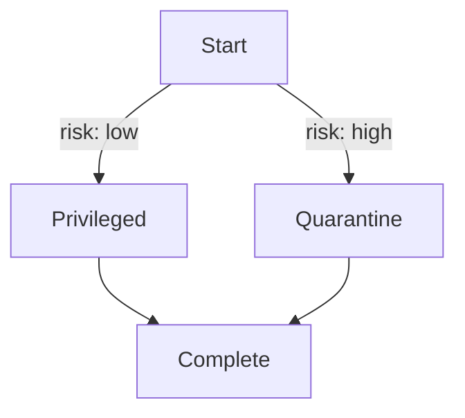

# Dual LLM Sandbox Pattern

High-risk tasks are executed by a quarantined agent inside a sandbox, while privileged agents remain isolated from untrusted input. The orchestrator inspects `state.data['risk_level']` before invoking privileged nodes.

## Example Flow

1. **Start** – the workflow begins and evaluates the request.
2. **Privileged** – normally performs sensitive actions.
3. **Quarantine** – sandboxed agent used when `risk_level` is `"high"`.
4. **Complete** – final step after either path.

The orchestration engine is configured with `set_quarantine_node("Quarantine")`. During execution, if a privileged node would receive high‑risk input, the engine automatically skips to the quarantine node. Privileged nodes also raise a `PermissionError` if invoked directly with high‑risk state, ensuring isolation even when misconfigured.
