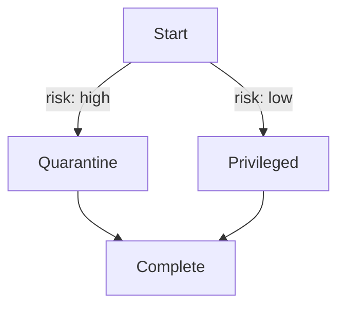

# Orchestration Engine Overview

The orchestration engine executes agent workflows as a directed graph. Nodes encapsulate agent functions while edges describe how state flows between them.

## Typed Edges

Edges can carry optional metadata via the `edge_type` field. This allows routers to select the next node based on labels rather than hard coded destinations.

Example YAML snippet:

```yaml
graph:
  nodes:
    - id: start
      agent: WebResearcher
    - id: success
      agent: Supervisor
    - id: failure
      agent: Supervisor
  edges:
    - from: start
      to: success
      edge_type: success
    - from: start
      to: failure
      edge_type: fail
```

Routers can inspect this metadata using `make_edge_type_router`:

```python
router = make_edge_type_router(engine, "start", state_key="path")
engine.add_router("start", router)
```

When `state.data['path']` equals `"fail"`, the engine will traverse the edge labelled `fail`.

## Quarantining High-Risk Tasks

Use `NodeType.PRIVILEGED` for nodes that perform sensitive actions. If `state.data['risk_level']` is set to "high", the engine automatically routes execution to the node registered via `set_quarantine_node()` instead of invoking the privileged node.



This ensures untrusted input never reaches privileged code paths, even if the graph edges would normally lead there.
