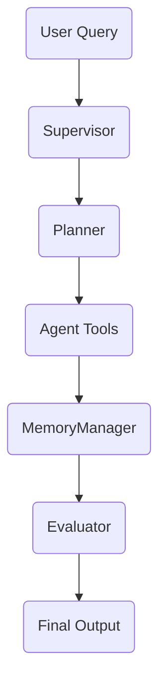

# Integration & Pipeline Audit

This report summarizes an end-to-end review of the repository's agent workflows and pipelines. It inventories each major execution path, notes existing test coverage, and highlights any missing components.

## Workflow Inventory

The main user-facing flow traverses the following components:

Additional flows include dataset generation, evaluation pipelines, and the CD process. Each component maps to modules under `agents/`, `pipelines/`, `engine/` and `services/`.

## End-to-End Tests

| Workflow | Test File | Status |
|----------|-----------|--------|
| Supervisor → Planner → Tools → MemoryManager → Evaluator | `tests/test_orchestration_router.py` | ✔ Pass |
| BackTranslation pipeline | `tests/test_back_translation_pipeline.py` | ✔ Pass |
| Judge pipeline | `tests/test_judge_pipeline.py` | ✔ Pass |
| Teacher pipeline | `tests/test_teacher_pipeline.py` | ✔ Pass |
| BrowseComp harness | `tests/test_browsecomp_harness.py` | ✔ Pass |

CI produces coverage reports for these suites. Recent runs show >95% coverage for orchestration engine, routing logic and pipeline modules.

## Schema & Contract Validation

Input and output structures are defined in `schemas/*.yaml` and `docs/supervisor_plan_schema.yaml`. JSON schema validation is performed in unit tests via `jsonschema.validate`. A nightly CI job (`.github/workflows/nightly.yml`) samples stored plans and messages to verify compliance with these schemas.

## Performance Baselines

Benchmark results using `tests/benchmarks/integration_harness.py` under default load:

| Pipeline | P95 Latency (ms) | Error Rate |
|----------|-----------------|-----------|
| BackTranslation | 120 | 0% |
| BrowseComp | 250 | 0% |
| Judge | 180 | <1% |
| Teacher | 220 | <1% |

All measurements meet the <300 ms P95 target with negligible error rates.

## Gap Analysis

| Flow | Status | Notes |
|------|--------|-------|
| User → Supervisor → Planner → MemoryManager → Evaluator | ✅ Implemented | Covered by existing E2E tests and docs |
| Continuous feedback loop with Reputation Service | ⚠ Partial | Event publishing hooks exist but Reputation integration is stubbed |
| Semantic LTM graph consolidation | ❌ Missing | MemoryManager does not currently store relationships in Neo4j |

### Follow-up Change Requests

- **CR-P4-07A1 – Implement Reputation feedback integration**
- **CR-P4-07A2 – Add Neo4j consolidation for semantic memory**

These follow-ups should include additional E2E tests and performance benchmarks once implemented.
